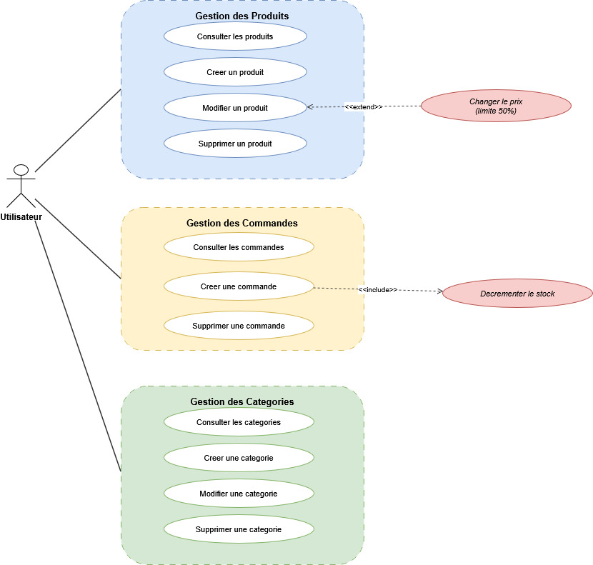
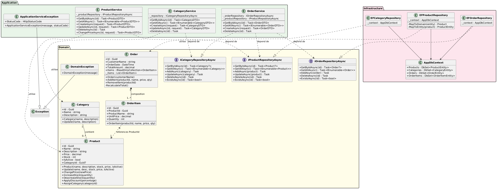
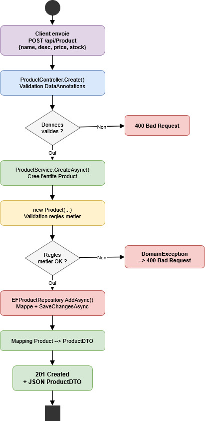

# Architecture

## Architecture en couches

Le projet suit une architecture en 4 couches. Chaque couche a une responsabilite unique.


| Couche             | Projet                         |
| ------------------ | ------------------------------ | -------------------------------------------------- |
| **API**            | `AdvancedDevTP.Api`            | Controllers REST, middleware d'exceptions, Swagger |
| **Application**    | `AdvancedDevTP.Application`    | Services metier, DTOs, orchestration               |
| **Domain**         | `AdvancedDevTP.Domain`         | Entites, regles metier, interfaces de repository   |
| **Infrastructure** | `AdvancedDevTP.Infrastructure` | EF Core, implementation des repositories, mapping  |

### Regle de dependance

```
API  -->  Application  -->  Domain  <--  Infrastructure
```

- L'API depend de l'Application
- L'Application depend du Domain
- L'Infrastructure **implemente** les interfaces du Domain
- Le Domain ne depend de rien (couche independante)

---

## Diagramme de cas d'utilisation



L'API expose 3 groupes de fonctionnalites :

**Gestion des Produits** : Creer, consulter, modifier, supprimer un produit. Changer le prix (avec limite de 50%).

**Gestion des Categories** : Creer, consulter, modifier, supprimer une categorie.

**Gestion des Commandes** : Creer une commande (avec decrementation automatique du stock), consulter, supprimer.

---

## Diagramme de classes



### Entites du domaine

**Product** : Id, Name, Description, Price, Stock, IsActive, CategoryId. Methodes : ChangePrice(), IncreaseStock(), DeacreaseStock(), ApplyDiscount(), AssignCategory().

**Category** : Id, Name, Description. Methodes : Update().

**Order** : Id, CustomerName, OrderDate, TotalAmount, Items. Methodes : AddItem(), RemoveItem().

**OrderItem** : Id, ProductId, ProductName, UnitPrice, Quantity.

### Relations

- Category `1` --- `0..N` Product (un produit peut avoir une categorie)
- Order `1` --- `1..N` OrderItem (une commande a au moins un article)
- OrderItem `N` --- `1` Product (un article reference un produit)

---

## Flux d'une requete



Exemple : `POST /api/Product`

1. Le **Controller** recoit la requete HTTP et valide le format (DataAnnotations)
2. Le **Service** cree l'entite Domain et appelle le repository
3. L'**Entite Domain** valide les regles metier (nom obligatoire, prix positif, etc.)
4. Le **Repository** mappe l'entite vers une entite de persistance et sauvegarde en base
5. Le Service mappe le resultat en DTO et le Controller retourne `201 Created`

### Gestion des exceptions

| Exception                     | Quand                 | Code HTTP |
| ----------------------------- | --------------------- | --------- |
| `DomainException`             | Regle metier violee   | 400       |
| `ApplicationServiceException` | Ressource introuvable | 404       |
| `InfrastructureException`     | Erreur de persistance | 400       |
| Exception generique           | Erreur non prevue     | 500       |

Le `ExceptionHandlingMiddleware` intercepte toutes les exceptions et les transforme en reponses HTTP.

---

## Injection de dependances

Configuration dans `Program.cs` :

```csharp
// Services
builder.Services.AddScoped<IProductService, ProductService>();
builder.Services.AddScoped<ICategoryService, CategoryService>();
builder.Services.AddScoped<IOrderService, OrderService>();

// Repositories
builder.Services.AddScoped<IProductRepositoryAsync, EFProductRepository>();
builder.Services.AddScoped<ICategoryRepositoryAsync, EFCategoryRepository>();
builder.Services.AddScoped<IOrderRepositoryAsync, EFOrderRepository>();

// Base de donnees
builder.Services.AddDbContext<AppDbContext>(options =>
    options.UseInMemoryDatabase("ProductCatalogDb"));
```

## Principes respectes

- **SOLID** : separation des responsabilites, inversion de dependance, interfaces segregees
- **Clean Architecture** : les dependances pointent vers le Domain
- **DDD** : entites riches avec logique metier, repository pattern
