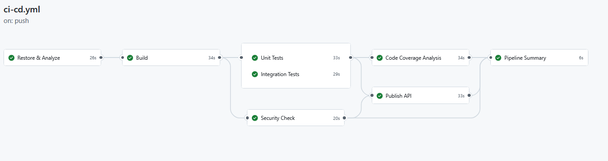

# CI/CD Pipeline

## Vue d'ensemble

Le projet utilise GitHub Actions avec 8 jobs :

## Jobs

| Job                 | Dependance                                      | Role                                          |
| ------------------- | ----------------------------------------------- | --------------------------------------------- |
| `restore-analyze`   | -                                               | Restauration NuGet + detection vulnerabilites |
| `build`             | restore-analyze                                 | Build Release + Debug                         |
| `unit-tests`        | build                                           | Tests unitaires (filtre `!~Integrations`)     |
| `integration-tests` | build                                           | Tests d'integration (filtre `~Integrations`)  |
| `security-check`    | build                                           | Analyse vulnerabilites NuGet                  |
| `code-coverage`     | unit-tests + integration-tests                  | Couverture de code Cobertura                  |
| `publish`           | unit-tests + integration-tests + security-check | Publication API (master + push uniquement)    |
| `summary`           | tous                                            | Resume de tous les jobs                       |

## Declencheurs

- **Push sur master** : execute tout, y compris la publication
- **Pull Request vers master** : execute tout sauf la publication

## Artefacts produits

| Artefact                   | Contenu                                         |
| -------------------------- | ----------------------------------------------- |
| `unit-test-results`        | Rapports TRX des tests unitaires                |
| `integration-test-results` | Rapports TRX des tests d'integration            |
| `coverage-reports`         | Rapport Cobertura XML                           |
| `api-publish`              | API publiee (DLLs + config) - master uniquement |
