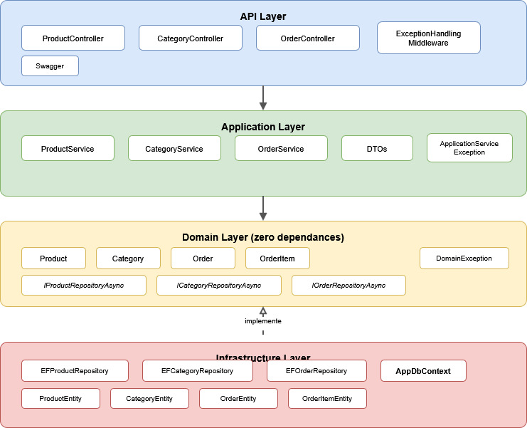

# AdvancedDevTP - Catalogue Produit API

## Presentation du projet

AdvancedDevTP est une API REST pour la gestion d'un catalogue de produits, construite avec ASP.NET Core 10 en suivant une architecture en couches.

L'API permet de gerer des **produits**, des **categories** et des **commandes clients**.

## Technologies

- .NET 10 / ASP.NET Core 10
- Entity Framework Core (InMemory)
- xUnit / Moq / FluentAssertions
- Swagger (Swashbuckle)
- GitHub Actions (CI/CD)

## Demarrage rapide

```bash
git clone https://github.com/yourusername/AdvancedDevTP.git
cd AdvancedDevTP
dotnet restore
dotnet build
dotnet test
cd AdvancedDevTP.Api
dotnet run
```

L'API est accessible a `http://localhost:5000` et Swagger a la racine `/`.

## Structure du projet

```
AdvancedDevTP/
├── AdvancedDevTP.Domain/           # Entites, regles metier, interfaces
├── AdvancedDevTP.Application/      # Services, DTOs, logique applicative
├── AdvancedDevTP.Infrastructure/   # EF Core, repositories, persistance
├── AdvancedDevTP.Api/              # Controllers, middleware, Swagger
├── AdvancedDevTP.Tests/            # Tests unitaires et d'integration
└── docs/                           # Documentation
```



## Navigation

- [Architecture](architecture.md) - Structure en couches et diagrammes
- [API Endpoints](api-endpoints.md) - Tous les endpoints REST
- [Tests](tests.md) - Strategie de test
- [CI/CD](ci-cd.md) - Pipeline GitHub Actions

**Auteur** : Mohamed Chiha
